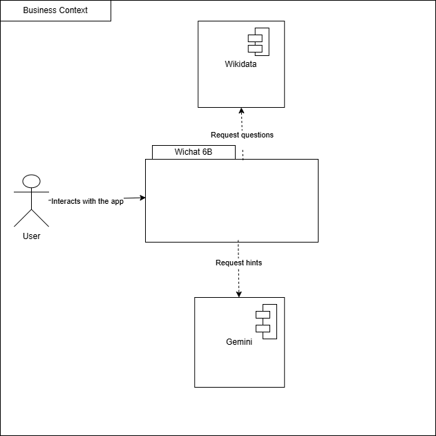

ifndef::imagesdir[:imagesdir: ../images]

[[section-context-and-scope]]
== Context and Scope

=== Business Context

|===
| Communication Partner | Inputs | Outputs

| **Client** | Username, password | Game score, questions retrieved from Wikidata  

| **Database** | Username, password, score of each game | Credential validation, score storage  

| **Wikidata** | Request for information about the game question | Generated question with relevant information  

| **Empathy/Gemini** | Game question and correct answer | Hints to help the user answer better  
|===

The development of the technical part is still in progress. However, the following technologies have been considered:

|===
| Technology            | Description                                      
| **Database**        | MongoDB                                          
| **Communication with ChatGPT** | SSH                                   
| **User Interface**  | React                                            
| **Server**          | Node.js                                          
| **Future Development** | More details on protocols and communication channels will be defined as development progresses. 
|===

