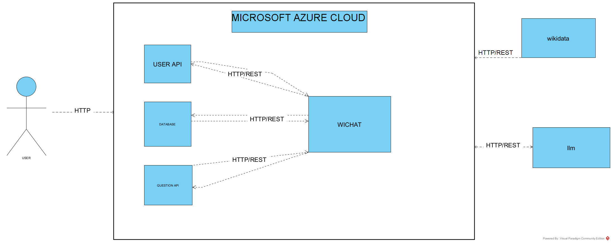

ifndef::imagesdir[:imagesdir: ../images]

[[section-context-and-scope]]
== Context and Scope

=== Business Context

|===
| Communication Partner | Description

| **Client**  | A normal user, that interacts with the app, playing the game, setting the profile picture...

| **Wikidata**  | Provide a list of questions with an array of answers(one of them the right one), and provides a link related to the question.

| **Gemini** | An llm, to give hints to help the user answer better the questions, in the game. 
|===

image::../images/contextAndScope.png[Diagram Business Context]

=== Technical Context

|===
| Technology            | Description                                      
| **Database**        | MongoDB                                          
| **Communication with Empathy/Gemini** | HTTP                                   
| **User Interface**  | React                                            
| **Server**          | Node.js                                          
| **Virtual Machine** | Azure
|===

[cols="1,2,3"]
|===

| Channels
| Type
| Input/Output

| HTTP/REST
| Output
| WICHAT -> User API

| HTTP/REST
| Output
| WICHAT -> Question  API

| HTTP/REST
| Input
| WICHAT -> Wikidata

| HTTP/REST
| Input
| WICHAT -> llm

| HTTP
| Input
| wichat -> Database 

| HTTP
| Output
| WICHAT -> Database 

|===

